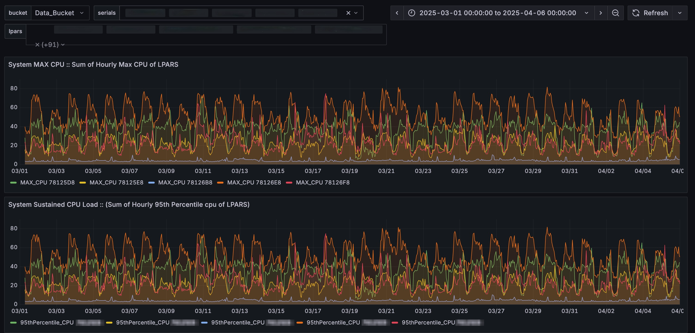

# BriefMon: Your Nmon Insights 'Briefcase'

Welcome! This tool makes it easy to visualize performance data from NMON files. 
Just drop your files in a folder on your laptop, run one command, and see your data come to life.

**The highlight here is the 'briefcase' concept:** The entire analysis environment is self-contained and runs on your own laptop. It's designed for the professional who can take this with them to client sites, perfectly capturing the "analyze anywhere" spirit.

### Prerequisites
- **Docker Desktop**: You must have Docker Desktop installed and running on your computer. You can download it for free from the official Docker website for both Windows and Mac: [https://www.docker.com/products/docker-desktop/](https://www.docker.com/products/docker-desktop/)

---

### First-Time Setup (You only do this once)
> **Warning:** Make sure you laptop is connected to the internet for the first time setup of this project on your laptop. Later you don't need the internet to use it.

**Step 1: Download the Project**
1.  Click the green `<> Code` button at the top of this GitHub page.
2.  Choose **Download ZIP**.
3.  Unzip the downloaded file to a permanent location on your computer, like your Desktop or Documents folder.

**Step 2: Launch the Application**
1.  **Open your computer's terminal:**
    -   **On Windows**: Open the Start Menu, type `PowerShell`, and press Enter.
    -   **On Mac**: Open Spotlight (Cmd+Space), type `Terminal`, and press Enter.

2.  **Navigate into the project folder** using the `cd` command.
    -   *Tip: You can type `cd ` (with a space) and then drag the project folder from your Desktop directly into the terminal window to paste its path.*

    -   **Example for Windows:**
        ```powershell
        cd C:\Users\YourName\Desktop\BriefMon\Engine
        ```
    -   **Example for Mac:**
        ```bash
        cd /Users/yourname/Desktop/BriefMon\Engine
        ```

3.  **Run the launch command.** The first time you run this, it will download all the necessary components, which may take a few minutes.
    ```bash
    docker-compose up -d
    ```

---

### How to Use the Dashboard

**Step 1: Add Your NMON Files**
-   Open the `nmon-files` folder inside the project directory.
-   Drag and drop the `.nmon` or `.nmon.gz` files you want to analyze into this folder.

**Step 2: Process the Files**
-   Open your terminal in the project folder.
-   Run the following command. This starts the injector script, which will find your files, process them, and send the data to the database.
    ```bash
    docker-compose up -d
    ```
-   This process can take anywhere from a few seconds to several minutes, depending on the number and size of your files. The script will run and then stop automatically when it's finished.

**Step 3: View Your Dashboard**
1. Open your web browser (Chrome, Firefox, etc.) and go to: **http://localhost:3001**
2. Log in using:
   - **Username:** `admin`
   - **Password:** `ab12`
3. Your dashboard will now be pre-loaded with the data you just processed!

Here is an example of a dashboard, visualizing CPU consumption of multiple servers.




**Step 4: Interact With Your Dashboard**

Once your dashboard is loaded, you can explore and filter the data using the controls at the top of the page.  

1. **Select a Time Range**
   - In the **top-right corner**, use the time selector (e.g., *Last 6 hours*).  
   - Set a custom start and end time in the format of YYYY-MM-DD HH:MM:SS or choose from preset ranges (like *Last 2 days*/...).
   - ⚠️ **Important:** Data is processed in local time only, the timezone there remains **UTC** for simplicity of project. 
     For accurate results, keep the timezone set to **UTC**, but the time you see is your local time of servers only.

2. **Filter by Server (`serials`)**
   - In the **top-left**, use the **`serials`** dropdown.  
   - This lists all unique server serial numbers from your processed files.  
   - Select one or multiple servers to compare performance.  

3. **Filter by LPAR (`lpars`)**
   - Next to **`serials`**, use the **`lpars`** dropdown.  
   - This shows the logical partitions (LPARs) for the selected server(s).  
   - Choose the LPAR(s) you want to analyze.  


### Recommended Workflow
1. Select your **Time Range**.  
2. Choose one or more **Server Serial(s)**.  
3. Pick the relevant **LPAR(s)**.  

The graphs will update automatically based on your selections.  


### 🔄 Data Availability & Refresh

**Don’t see your new data right away?**  
- After processing new NMON files, all the related `serials` or `lpars` may take **1–2 minutes** to fully appear. Until then you could be seeing some serials and lpars, but not all.
- This is normal, as Grafana **caches filter options** to improve performance.  

**What to do:**  
- Wait a minute, then click the **Refresh Dashboard** icon (🔄 at the top-right).  
- This forces the filters to reload with the latest data.  

👉 Your data is already in the database — the dashboard just needs a moment to catch up.  
 
---

### Managing Your Projects (Daily Use)

All the following commands must be run from a terminal that is open inside the project folder.

---

**To Process New Data or Add to Existing Data**
1. Place your new `.nmon` files in the `nmon-files` folder.  
   *(It's good practice to remove old, already-processed files).*
2. Run the standard start command. This will process your new files:
   ```bash
   docker-compose up -d
   ```

**To Shut Down After Use**

When you are finished, stop the services with:
1.  Run this command:
    ```bash
    docker-compose down 
    ```
    > **Warning:** This command does not delete your data.
  

**To Start a Completely New Project (Delete ALL Old Data)**

1. Permanently delete all data from your last project:
    ```bash
        docker-compose down -v
    ```
2. Add your new nmon data to the nmon-files folder.

3. Launch 
   ```bash
   docker-compose up -d
   ```

**To Update the Application**
If you receive an updated nmon-injector file, or other code files from the developer:
1. Replace the old file in the dist/ folder with the new one.
2. Rebuild the application with the update:
    ```bash
    docker-compose up --build -d
    ```

---
