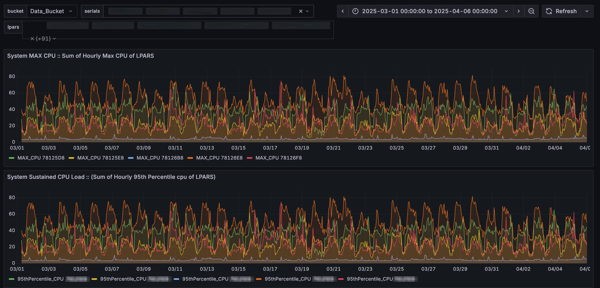

# BriefMon: Your Nmon Insights 'Briefcase'

Welcome! This tool makes it easy to visualize performance data from NMON files. 
Just drop your files in a folder on your laptop, run one command, and see your data come to life.

**The highlight here is the 'briefcase' concept:** The entire analysis environment is self-contained and runs on your own laptop. It's designed for the professional who can take this with them to client sites, perfectly capturing the "analyze anywhere" spirit.

**Currently the utility supports AIX nmon data for shared partitions. Support for AIX dedicated partitions and LINUX Nmon data will be added soon** 

### Prerequisites
- **Docker Desktop**: You must have Docker Desktop installed and running on your computer. You can download it for free from the official Docker website: [https://www.docker.com/products/docker-desktop/](https://www.docker.com/products/docker-desktop/)

---

### First-Time Setup (You only do this once)
> **Warning:** Make sure you laptop is connected to the internet for the first time setup of this project on your laptop. Later you don't need the internet to use it.

**Step 1: Download the Project**
1.  Click the green `<> Code` button at the top of this GitHub page.
2.  Choose **Download ZIP**.
3.  Unzip the downloaded file to a permanent location on your computer, like your Desktop or Documents folder.

**Step 2: Launch the Application**

1.  **Open the the Engine folder of the BriefMon in Terminal**
    - Right-click on the Engine folder and select:
        - **“Open in Terminal”** (Mac/Linux)

    This will open the terminal directly in the correct folder. No manual path or `cd` command is required.

2.  **Run the launch command.** The first time you run this, it will download all the necessary components, which may take upto a minute.
    ```bash
    docker-compose up -d
    ```

---

### How to Use the Tool

**Step 1: Add Your NMON Files**
-   Open the `nmon-files` folder inside the project directory.
-   Drop your folders with `.nmon` or `.nmon.gz` files that you want to analyze, here into this folder.

**Step 2: Process the Files**
-   Open your terminal in the project folder.
-   Run the following command. This starts the injector script, which will find your files, process them, and send required data to the  database.
    ```bash
    docker-compose up -d
    ```
-   This process can take a few seconds, depending on the number and size of your files. The script will run and then stop automatically when it's finished.

**Step 3: View Your Dashboard**
1. Open your web browser (Chrome, Firefox, etc.) and go to: **http://localhost:3001**
2. Log in using:
   - **Username:** `admin`
   - **Password:** `ab12`
3. Go to the Dashboards section here and choose which dashboard you want to view. Your dashboard will now be pre-loaded with the data you just processed!

Here is an example of a dashboard, visualizing CPU consumption of multiple servers.




**Step 4: How To Interact With Your Dashboard**

Once your dashboard is loaded, you can explore and filter the data using the controls at the top of the page.  

1. **Filter by Server (`serials`)**
   - In the **top-left**, use the **`serials`** dropdown.  
   - This lists all unique server serial numbers from your processed files.  
   - Select one or multiple servers to compare performance.  

2. **Filter by LPAR (`lpars`)**
   - Next to **`serials`**, use the **`lpars`** dropdown.  
   - This shows the logical partitions (LPARs) for the selected server(s).  
   - Choose the LPAR(s) you want to analyze.

3. **Select a Time Range**
   - In the **top-right corner**, use the time selector (e.g., *Last 6 hours*).
   - Set a custom start and end time in the format `YYYY-MM-DD HH:MM:SS`.
   - **Alternative (easier):** You can also **click and drag on any graph** to zoom into a specific time window.  
     **Double-click** on the graph to zoom back out. With this option you will not have to manually enter the start and end time.
   - ⚠️ **Important NOTE:** The timezone shown remains **UTC** for project simplicity, BUT time data is processed and presented here in local server timezone only.
     SO for accurate results, keep the timezone set to **UTC** only. The time data you seen in the graphs is in your local server timezone only (its not modified by the tool to UTC)

The graphs will update automatically based on your selections.  


### 🔄 Data Availability & Refresh

**Don’t see your new data right away?**  
- After processing new NMON files, all the related `serials` or `lpars` may take a minute to fully appear. Until then you could be seeing some serials and lpars, but not all.
- This is normal, as Grafana **caches filter options** to improve performance. 
You can always refresh the window, although its not needed because it will update automatically.  

👉 Your data is already in the database — the dashboard just needs a moment to catch up.  
 
---

### Managing Your Projects (Daily Use)

All the following commands must be run from a terminal that is open inside the Engine folder of the tool.

---

**To Process New Data or Add to Existing Data**
1. Place your new nmon data folders in the `nmon-files` folder.  
   *(It's good practice to remove old nmon data which is no longer needed so that influxdb can be refreshed with only the required data).*
2. Run the standard start command. This will process your new files:
   ```bash
   docker-compose up -d
   ```

**To Shut Down After Use**

When you are finished, stop the services with:
1.  Run this command:
    ```bash
    docker-compose down 
    ```
    > **Warning:** This command does not delete your data.
  

**To Start a Completely New Project (Delete ALL Old Data)**

1. Permanently delete all data in database from your last project:
    ```bash
        docker-compose down -v
    ```
2. Add your new nmon data to the nmon-files folder and remove the old ones.

3. Launch 
   ```bash
   docker-compose up -d
   ```

---
